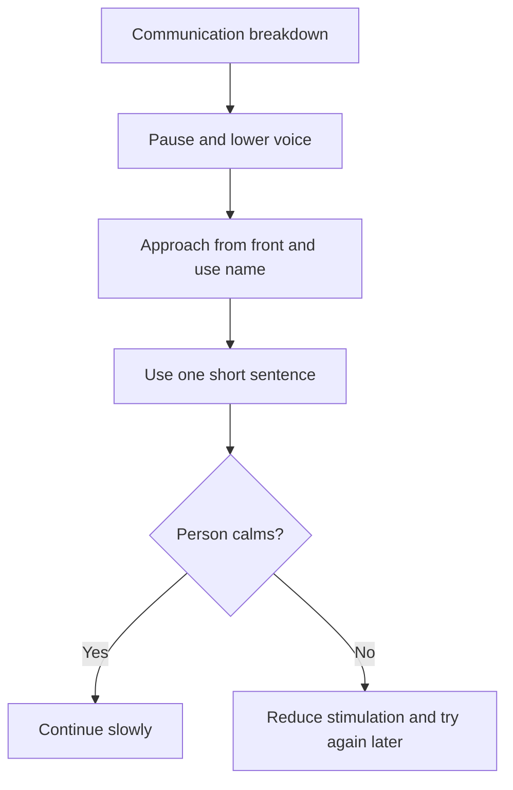

# General Dementia Communication Principles

## Situation

The person is confused, upset, misinterpreting the situation, or struggling to follow conversation.

## Likely Causes

- Memory loss
- Difficulty processing language
- Fear or embarrassment
- Sensory overload
- Too many choices
- Caregiver speaking too quickly
- Unfamiliar environment

## Caregiver Should Do

- Approach slowly from the front.
- Use the person's name.
- Speak in a calm, low voice.
- Use short sentences.
- Offer one instruction at a time.
- Give extra time to respond.
- Use gestures and visual cues.
- Offer simple choices.

## Suggested Script

"Hi, it is me. You are safe. Let us sit together for a moment."

## Caregiver Should Avoid

- Do not quiz memory.
- Do not say "Do you remember?"
- Do not argue.
- Do not rush.
- Do not give too many choices.
- Do not speak as if the person is a child.

## Personalization Notes

If the person has hearing loss, reduce background noise and face them clearly.

If the person has vision loss, improve lighting and use clear visual cues.

## Escalation

Escalate if confusion is sudden, severe, or very different from baseline.

## Decision Flow

