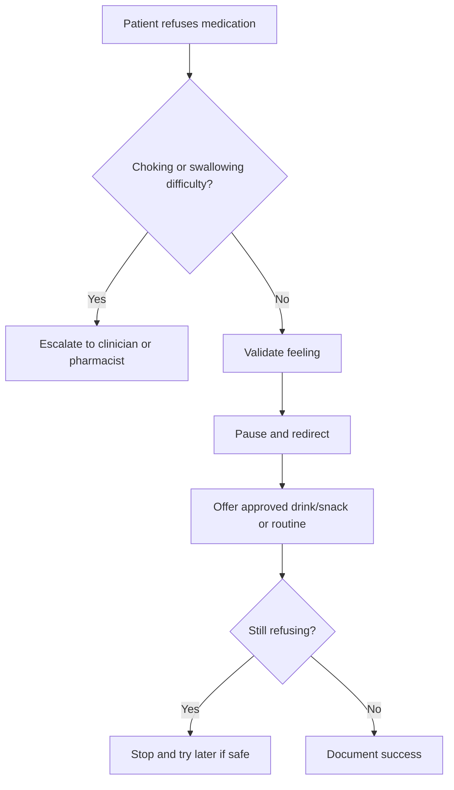

# Handling Medication Refusal

## Situation

The person refuses medication, becomes suspicious of pills, spits medication out, or says they do not need it.

## Likely Causes

- Fear or confusion
- Pill size or taste
- Swallowing discomfort
- Fatigue from repeated medication routines
- Suspicion or lack of trust in the moment
- Medication side effects

## Caregiver Should Do

- Stay calm.
- Validate the feeling.
- Pause and give space.
- Offer medication again later if safe.
- Pair with a familiar routine.
- Use an approved drink or snack only if safe for that medication and patient.
- Ask a pharmacist, nurse, or physician before crushing, hiding, or mixing medication with food.

## Suggested Script

"I understand you are tired of taking these pills. They do look big. Let us sit for a minute, then we can try with your drink."

## Caregiver Should Avoid

- Do not force the medication.
- Do not argue.
- Do not lecture.
- Do not threaten.
- Do not say "the doctor ordered it" if that escalates the person.
- Do not crush or hide medication unless a clinician or pharmacist confirms it is safe.

## Personalization Notes

If the person has diabetes, avoid sugary treats unless approved.

If the person has swallowing difficulty, escalate to a clinician or pharmacist.

If the medication is time-critical, follow the care plan and contact the care team if refusal continues.

## Escalation

Escalate if critical medication is repeatedly missed, there is choking or swallowing difficulty, overdose is possible, or refusal is new and severe.

## Decision Flow

