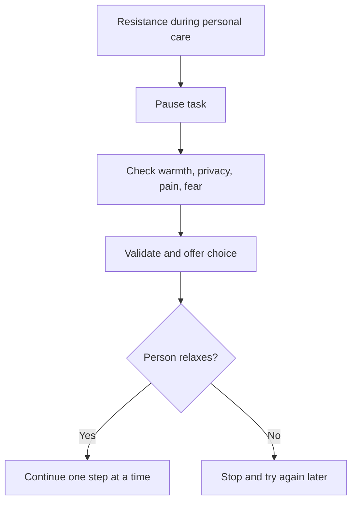

# Managing Agitation and Resistance During Personal Care

## Situation

The person resists bathing, dressing, grooming, toileting, changing clothes, or other personal care.

## Likely Causes

- Feeling cold
- Feeling exposed
- Embarrassment
- Pain
- Fear
- Confusion about what is happening
- Past trauma
- Caregiver moving too quickly

## Caregiver Should Do

- Keep the room warm.
- Protect privacy with towels, robes, or blankets.
- Explain one step at a time.
- Offer simple choices.
- Ask permission before touching.
- Approach from the front.
- Stand beside the person rather than directly blocking them.
- Use a gentle voice.
- Stop and try again later if the person becomes distressed.

## Suggested Script

"I am going to help you get comfortable. We can start with your hands first. Would you like the blue towel or the white towel?"

## Caregiver Should Avoid

- Do not force bathing or dressing.
- Do not remove clothing suddenly.
- Do not crowd the person.
- Do not argue about hygiene.
- Do not have multiple people enter unless necessary for safety.
- Do not continue if the person is frightened or aggressive.

## Personalization Notes

If trauma history is known or suspected, avoid sudden touch, blocked exits, and forced care.

If pain is possible, consider whether movement, water temperature, or touch is causing discomfort.

## Escalation

Escalate if personal care triggers repeated aggression, injury risk, severe distress, or possible pain that is not being treated.

## Decision Flow

