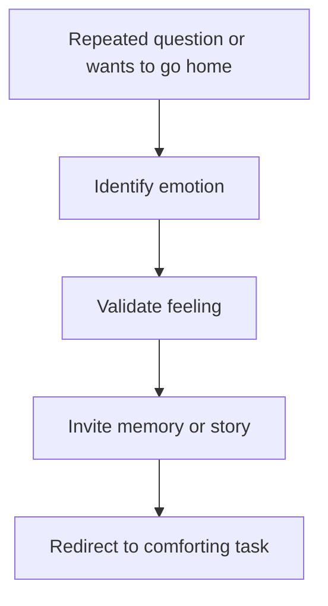

# Responding to Repetitive Questions and Wanting to Go Home

## Situation

The person repeatedly asks the same question, asks to go home, asks for work, or asks for a deceased loved one.

## Likely Causes

- Anxiety
- Need for safety
- Need for belonging
- Missing a familiar person
- Disorientation
- Fatigue or overstimulation

## Caregiver Should Do

- Validate the emotion behind the words.
- Avoid repeatedly correcting.
- Invite reminiscence.
- Redirect to a comforting current activity.
- Use a calm, consistent phrase.

## Suggested Script

"You are thinking about home. Tell me what you liked most about it."

"You miss your mom. What was she like?"

"That sounds beautiful. Let us have some tea while you tell me more."

## Caregiver Should Avoid

- Do not say harshly that a loved one is dead.
- Do not repeatedly say "You already asked me that."
- Do not argue that this is their home.
- Do not shame them for forgetting.

## Personalization Notes

Use known life history: childhood home, favorite foods, work identity, family role, music, culture, or familiar routines.

## Escalation

Escalate if repetitive questioning is sudden, linked with severe distress, or accompanied by new confusion, fever, pain, or signs of illness.

## Decision Flow

