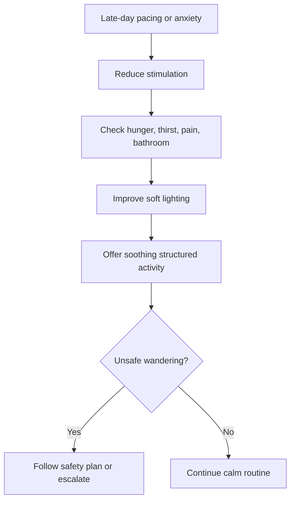

# Sundowning and Afternoon Pacing Management

## Situation

The person becomes more confused, anxious, restless, or physically active in the late afternoon or evening.

## Likely Causes

- Fatigue
- Hunger or thirst
- Pain
- Too much noise
- Shadows or poor lighting
- Change in routine
- Reduced daylight
- Unmet need for movement

## Caregiver Should Do

- Reduce noise and background TV.
- Close blinds if shadows are frightening.
- Use soft but adequate lighting.
- Keep walking paths clear.
- Offer structured soothing activities earlier in the day.
- Offer a safe walk or simple task.
- Maintain consistent evening routines.

## Suggested Script

"It feels a little busy right now. Let us sit somewhere quieter. You are safe."

## Caregiver Should Avoid

- Do not leave unsafe paths cluttered.
- Do not overstimulate with loud TV or busy rooms.
- Do not argue about the time of day.
- Do not use darkness that increases fall risk.

## Personalization Notes

If the person has fall risk, prioritize lighting, clear pathways, and supervision.

If the person enjoys music, use calm familiar music before the usual sundowning period.

## Escalation

Escalate if pacing creates fall risk, the person attempts to leave unsafely, or symptoms are sudden and severe.

## Decision Flow

