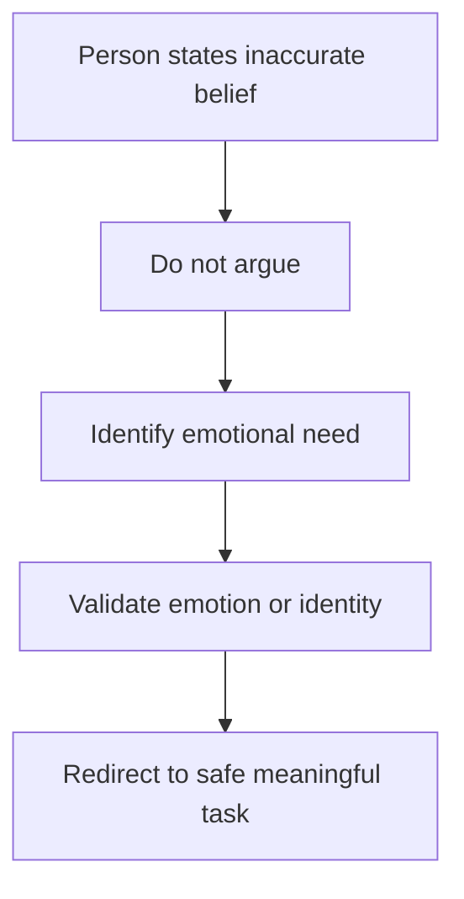

# Validation Therapy vs Reality Orientation

## Situation

The person says something that is not factually true, such as needing to go to work, being in the wrong year, or waiting for someone from the past.

## Key Principle

Direct correction may help some people in early dementia, but in moderate-to-severe dementia it often increases anger, fear, or shame.

Validation focuses on the emotional truth behind the statement.

## Caregiver Should Do

- Listen for the feeling.
- Validate identity, pride, worry, or responsibility.
- Ask a gentle question.
- Redirect to a meaningful current task.

## Suggested Script

"You want to make sure you do a good job. What kind of work do you do?"

"That sounds important. Could you help me with this task first?"

## Caregiver Should Avoid

- Do not repeatedly say "No, that is wrong."
- Do not argue about the year.
- Do not insist they are retired.
- Do not shame the person for believing something different.

## Personalization Notes

Use former roles and meaningful identities for redirection: parent, teacher, nurse, engineer, homemaker, manager, artist, gardener, or community member.

## Escalation

Escalate if beliefs become frightening, dangerous, or suddenly much worse than usual.

## Decision Flow

