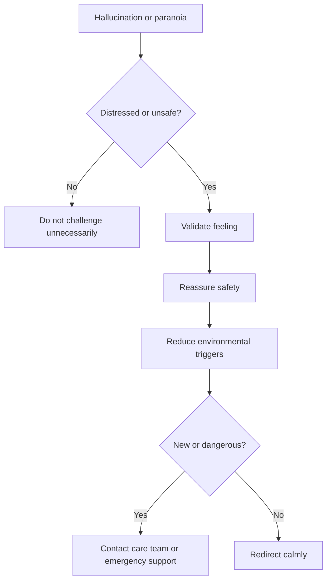

# Responding to Hallucinations, Delusions, or Paranoia

## Situation

The person sees, hears, or believes something that others do not. They may believe someone is stealing, hiding things, watching them, or trying to harm them.

## Likely Causes

- Dementia-related perception changes
- Shadows, mirrors, or poor lighting
- Misplaced items
- Loud or confusing TV
- Infection or delirium
- Medication side effects
- Vision or hearing changes

## Caregiver Should Do

- Stay calm.
- Assess whether the person is distressed or unsafe.
- Validate the feeling without confirming the false belief.
- Reduce triggers like shadows, mirrors, loud TV, or clutter.
- Redirect to a calmer room or familiar activity.
- Help search briefly if the person thinks something is missing.

## Suggested Script

"That sounds scary. I am here with you. You are safe."

"Let us look together, then we can sit somewhere quieter."

## Caregiver Should Avoid

- Do not mock the belief.
- Do not argue intensely.
- Do not say "You are hallucinating" in the moment.
- Do not reinforce the false belief as fact.
- Do not leave the person alone if they are frightened or unsafe.

## Personalization Notes

If the person has vision loss, improve lighting and reduce visual clutter.

If symptoms are new after a medication change, recommend contacting the care team.

## Escalation

Escalate if hallucinations or paranoia are new, worsening, dangerous, or causing severe distress.

## Decision Flow

