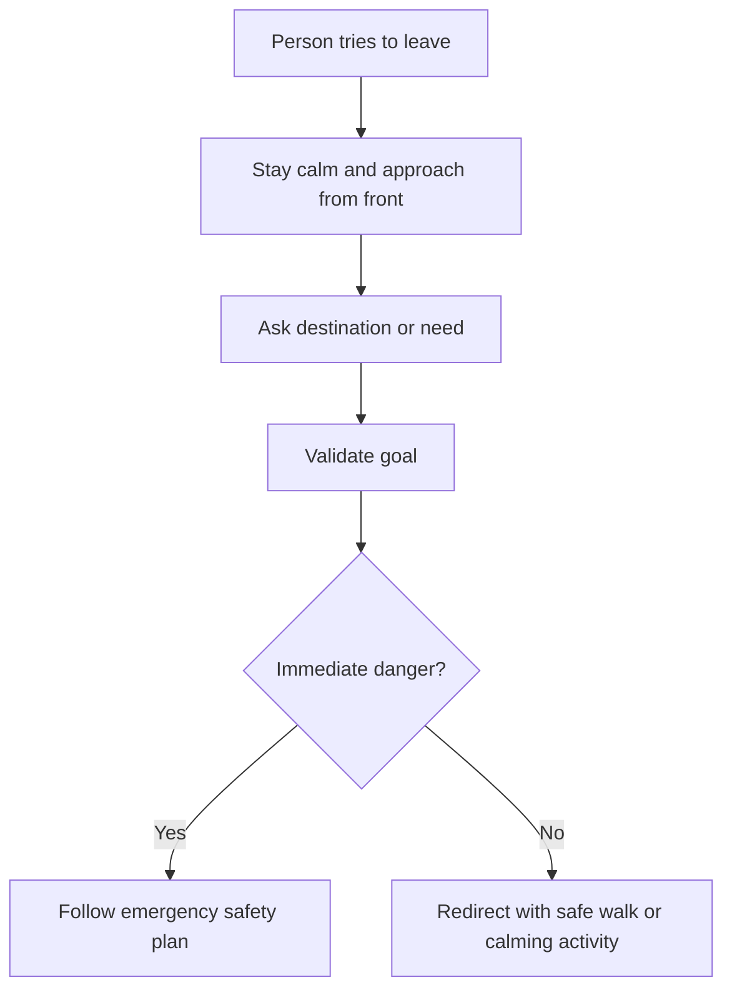

# Wandering, Exit-Seeking, and I Need to Leave

## Situation

The person tries to leave, searches for an exit, says they need to go home, or walks without a clear destination.

## Likely Causes

- Searching for home or safety
- Looking for a loved one
- Need for bathroom
- Boredom or need for movement
- Former work routine
- Anxiety
- Pain or discomfort
- Overstimulation

## Caregiver Should Do

- Stay calm.
- Avoid aggressively blocking the person.
- Ask where they are hoping to go.
- Validate the goal.
- Redirect with a pause or transitional activity.
- Offer safe movement if appropriate.
- Follow the agreed wandering safety plan.

## Suggested Script

"You want to go somewhere important. Let us get your coat and have some tea first."

"Where are you hoping to go? I will walk with you for a bit."

## Caregiver Should Avoid

- Do not grab unless there is immediate danger.
- Do not block exits aggressively.
- Do not shout from across the room.
- Do not argue that they are already home.
- Do not leave unsafe exit-seeking unattended.

## Personalization Notes

If the person used to commute to work, validate responsibility and redirect to a work-like helper task.

If fall risk is high, offer supervised movement in a safe area.

## Escalation

Escalate if the person is missing, tries to leave into unsafe conditions, becomes aggressive near exits, or cannot be redirected safely.

## Decision Flow

