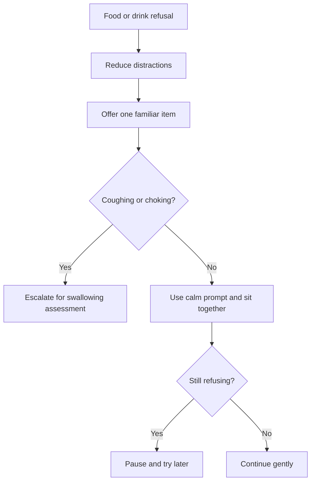

# Eating, Drinking, and Mealtime Refusal

## Situation

The person refuses food or fluids, becomes agitated at meals, does not recognize food, or eats very little.

## Likely Causes

- Poor appetite
- Dental pain
- Swallowing difficulty
- Depression or fatigue
- Too many choices
- Distracting environment
- Unfamiliar food
- Food temperature or texture
- Not recognizing utensils or food

## Caregiver Should Do

- Keep the meal calm.
- Reduce distractions.
- Offer one item at a time.
- Use familiar foods.
- Sit with the person.
- Give gentle prompts.
- Check whether dentures, glasses, or hearing aids are needed.
- Offer fluids regularly.

## Suggested Script

"Here is your soup. Let us try one spoon together."

"This is your tea. I will sit with you."

## Caregiver Should Avoid

- Do not rush.
- Do not scold.
- Do not force food.
- Do not overwhelm with a full plate if it causes confusion.
- Do not ignore coughing, choking, or pocketing food.

## Personalization Notes

If the person has diabetes, follow the care plan for snacks and drinks.

If swallowing difficulty is known or suspected, follow texture recommendations and escalate.

## Escalation

Escalate if there is choking, coughing during meals, pocketing food, dehydration, major weight loss, or repeated refusal of food and fluids.

## Decision Flow

