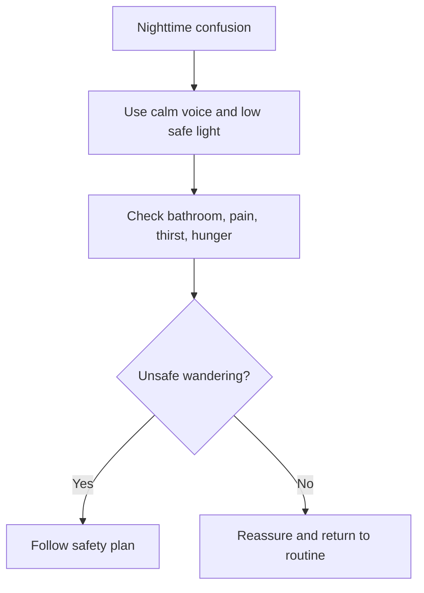

# Sleep Problems and Nighttime Confusion

## Situation

The person wakes at night, becomes confused, tries to leave, calls out, or believes it is daytime.

## Likely Causes

- Disrupted sleep-wake cycle
- Need for bathroom
- Pain
- Hunger or thirst
- Poor lighting
- Fear
- Daytime inactivity
- Long late-day naps
- Medication side effects

## Caregiver Should Do

- Keep voice calm and quiet.
- Use low, safe lighting.
- Reassure the person.
- Check bathroom need, pain, hunger, or thirst.
- Guide gently back to rest if appropriate.
- Encourage daytime light and safe activity.
- Keep bedtime routine consistent.

## Suggested Script

"It is nighttime. You are safe. I am here. Let us get comfortable again."

## Caregiver Should Avoid

- Do not turn on bright lights unnecessarily.
- Do not argue about the time.
- Do not scold the person for waking.
- Do not leave the person walking unsafely in the dark.

## Personalization Notes

If fall risk is high, ensure night lights, clear pathways, and bathroom visibility.

If sleep changes are sudden after medication changes, contact the care team.

## Escalation

Escalate if sleep change is sudden, severe, linked to pain, breathing problems, falls, unsafe wandering, or medication side effects.

## Decision Flow

