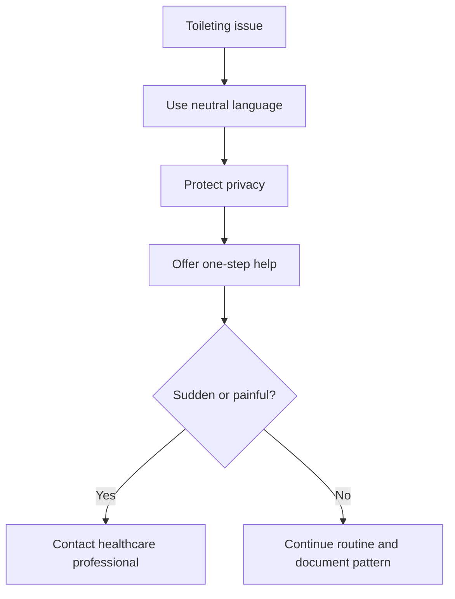

# Incontinence and Toileting Resistance

## Situation

The person has a toileting accident, resists bathroom help, refuses changing, or becomes embarrassed or angry during toileting.

## Likely Causes

- Not finding the bathroom
- Difficulty removing clothing
- Embarrassment
- Fear or privacy concerns
- Constipation
- Urinary urgency
- Infection
- Mobility issues
- Confusion about cues

## Caregiver Should Do

- Use neutral, dignity-preserving language.
- Offer regular bathroom opportunities.
- Keep the bathroom easy to find.
- Use clear lighting and signs.
- Choose easy-to-remove clothing.
- Protect privacy.
- Explain one step at a time.

## Suggested Script

"Let us get you comfortable. I will give you privacy and help only where needed."

## Caregiver Should Avoid

- Do not blame or shame.
- Do not say "You had an accident" harshly.
- Do not rush.
- Do not expose the person unnecessarily.
- Do not argue if they are embarrassed.

## Personalization Notes

If mobility is limited, check whether bathroom access, grab bars, or clothing are contributing.

If trauma history exists, ask permission before touch and avoid crowding.

## Escalation

Escalate if incontinence is sudden, painful, associated with fever, blood, severe confusion, or repeated distress.

## Decision Flow

