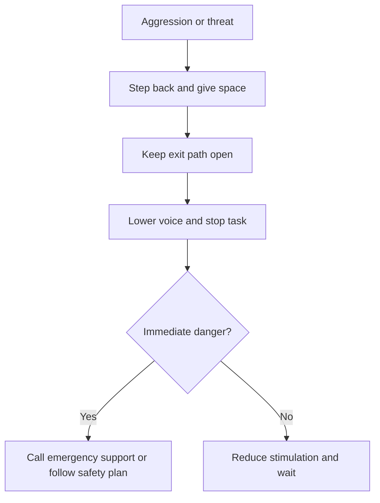

# Aggression, Threats, or Unsafe Situations

## Situation

The person yells, threatens, hits, pushes, grabs, throws objects, or becomes physically unsafe.

## Likely Causes

- Fear
- Pain
- Feeling trapped
- Too much noise
- Personal care distress
- Delirium or infection
- Medication side effects
- Misunderstanding the caregiver's intent

## Caregiver Should Do

- Step back.
- Keep an exit path open.
- Lower voice.
- Reduce stimulation.
- Give personal space.
- Use short reassurance.
- Stop the triggering task.
- Prioritize safety over completing care.

## Suggested Script

"You are safe. I am stepping back. We can stop for now."

## Caregiver Should Avoid

- Do not restrain unless trained and required by an emergency care plan.
- Do not corner the person.
- Do not grab.
- Do not shout.
- Do not argue.
- Do not continue the task while the person is escalating.

## Personalization Notes

If aggression happens during a specific task, treat that task as a trigger and redesign the routine.

If pain is possible, consider medical review.

## Escalation

Escalate immediately if there is danger to the person, caregiver, or others.

Contact the care team if aggression is new, repeated, or very different from baseline.

## Decision Flow

