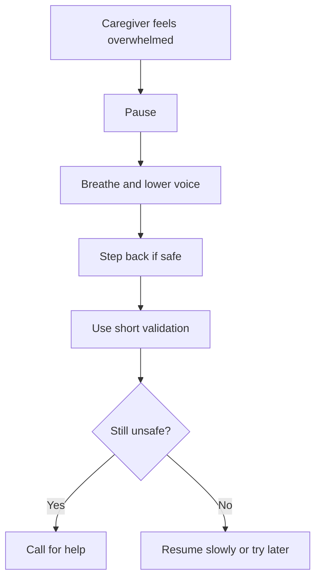

# Caregiver Self-Regulation

## Situation

The caregiver feels frustrated, scared, rushed, embarrassed, or overwhelmed.

## Key Principle

The caregiver's tone, posture, facial expression, and speed can either calm or escalate the situation.

## Caregiver Should Do

- Pause before responding.
- Breathe slowly.
- Lower voice.
- Soften facial expression.
- Relax shoulders and hands.
- Step back if safe.
- Speak less.
- Validate first, redirect second.
- Ask for help if overwhelmed.

## Suggested Coaching Prompt

"Pause. Lower your voice. Give space. Validate first. Redirect second."

## Suggested Script

"I am going to slow down. You are safe. We can take a break."

## Caregiver Should Avoid

- Do not match the person's volume.
- Do not argue to prove a point.
- Do not rush through care.
- Do not continue when emotionally overwhelmed unless safety requires it.

## Personalization Notes

If the caregiver has been under stress for a long period, recommend respite, support, or contacting the care team.

## Escalation

Escalate if the caregiver feels unable to keep the person or themselves safe.

## Decision Flow

