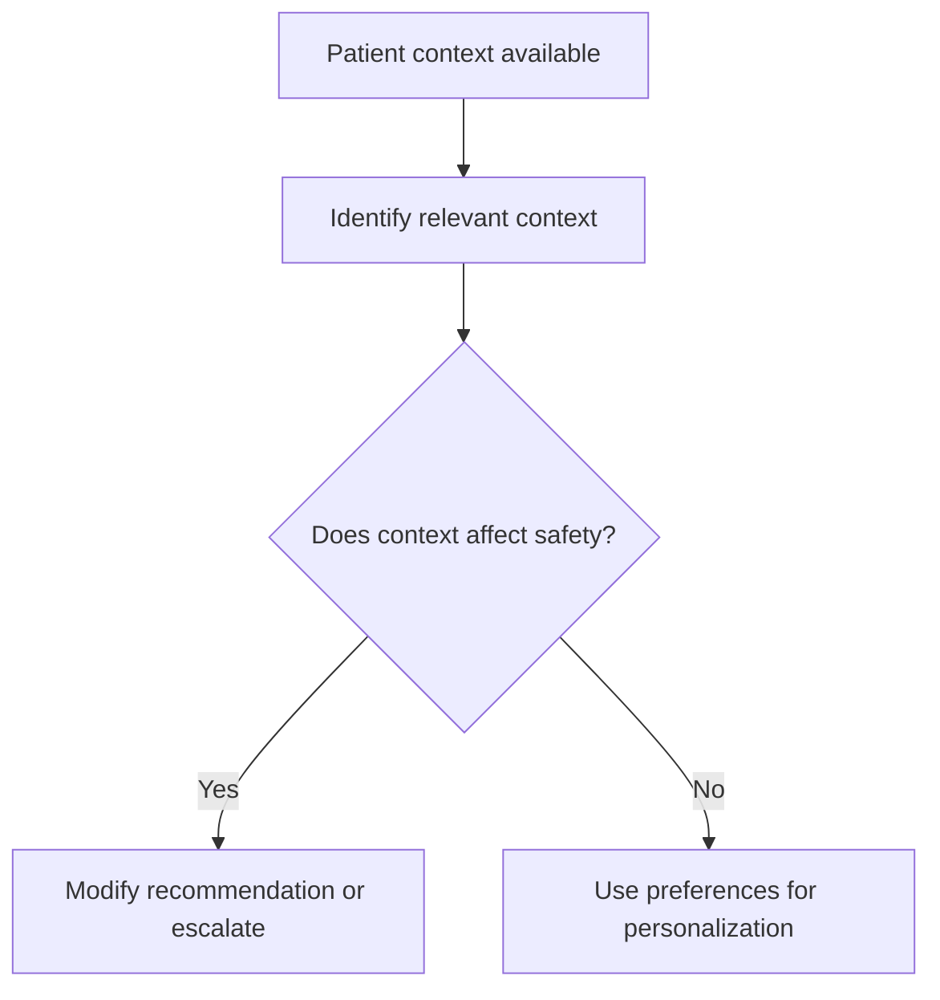

# Using Patient Context Safely

## Situation

The app has access to relevant patient context such as medical history, routines, trauma history, communication needs, preferences, or life story.

## Caregiver Should Do

- Use context only when relevant.
- Adapt scripts to the person's identity and preferences.
- Consider medical restrictions before suggesting snacks, walking, fluids, or medication strategies.
- Consider trauma-informed care when touch, bathing, privacy, or exits are involved.
- Use familiar routines and meaningful roles for redirection.

## Examples

For diabetes:

"Use a non-sugary approved snack or drink instead of a cookie."

For trauma history:

"Ask permission before touch. Avoid blocking the door. Give the person control with simple choices."

For hearing loss:

"Face the person, reduce background noise, and speak clearly."

For fall risk:

"Do not suggest unsupervised walking. Clear the path and use safe lighting."

## Caregiver Should Avoid

- Do not expose sensitive history unnecessarily.
- Do not make medical recommendations beyond the care plan.
- Do not suggest food, fluids, movement, or medication changes that conflict with known restrictions.

## Escalation

Escalate when patient context indicates higher risk, such as swallowing difficulty, fall risk, trauma triggers, medication risk, or sudden medical change.

## Decision Flow

