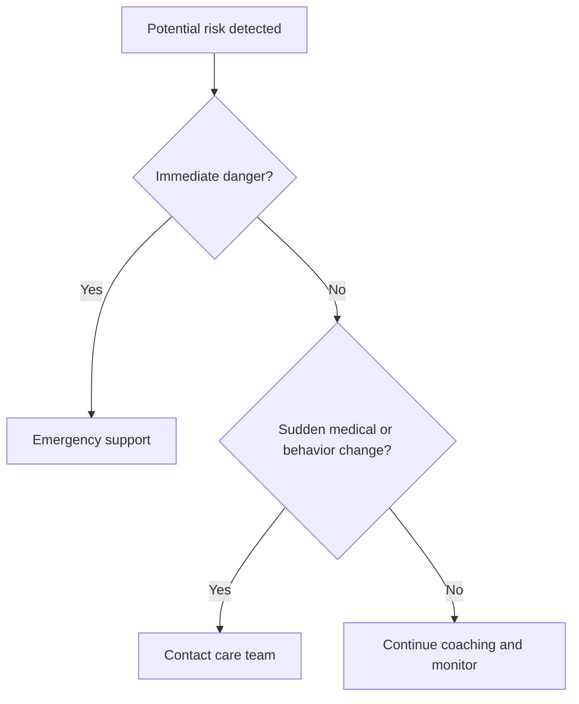

# When the App Should Escalate

## Situation

The app detects or is told about a possible safety or medical risk.

## Escalate Immediately For

- Immediate danger to the person or caregiver
- Choking
- Difficulty breathing
- Chest pain
- Serious fall or injury
- Stroke-like symptoms
- Severe aggression with risk of harm
- Missing person or unsafe wandering
- Medication overdose

## Contact Care Team For

- Sudden confusion or behavior change
- New hallucinations or paranoia
- New aggression
- Repeated medication refusal
- Possible medication side effects
- Dehydration
- Major weight loss
- Swallowing issues
- New incontinence
- Persistent sleep problems
- Caregiver burnout

## Suggested Script

"This may need human help. Please contact the care team now. If there is immediate danger, use emergency support."

## Caregiver Should Avoid

- Do not wait if there is immediate danger.
- Do not rely only on the app for urgent medical decisions.
- Do not ignore sudden changes from baseline.

## App Boundary

The app gives communication coaching and safety prompts. It does not diagnose, prescribe, or replace emergency care.

## Decision Flow

