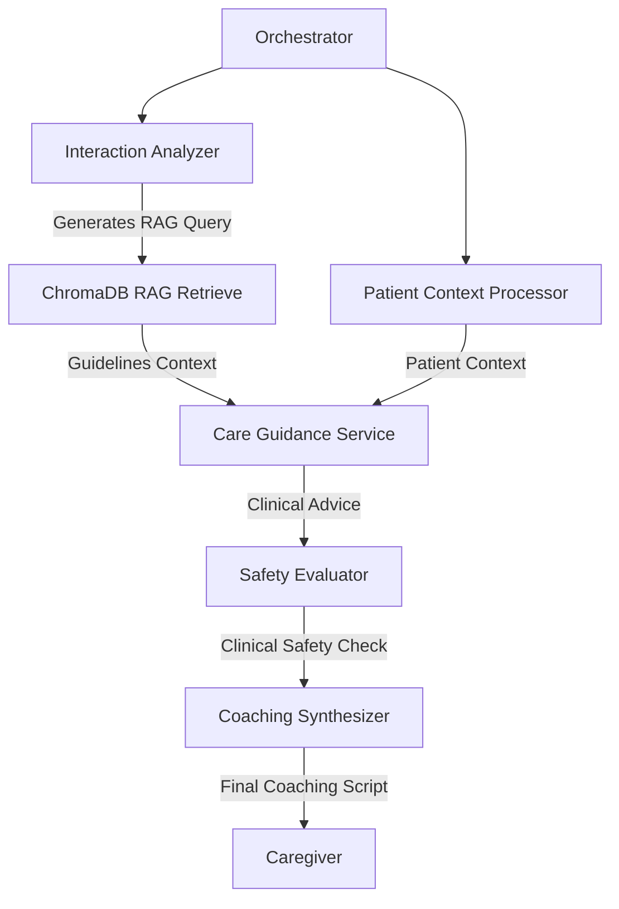

# STRIDE Threat Model Assessment: DementiaCare Coach

This document details the threat modeling assessment of the **DementiaCare Coach** sequential pipeline and backend architecture using the STRIDE methodology.

---

## 1. System Description & Data Flow

DementiaCare Coach is a modular 6-step sequential pipeline that coordinates caregiver interactions, retrieves clinical guidelines via a RAG pipeline (ChromaDB), and produces coaching feedback using the Google Gemini API.

### Boundaries & Entry Points
* **Entry Points**: FastAPI public HTTP endpoints defined in [main.py](file:///workspaces/dementia_care_assist/backend/app/main.py) (`/patient`, `/guidelines/seed`, `/analyze/text`, `/analyze/file`, `/simulator/step`).
* **Data Flow**:
  1. Caregiver inputs text or uploads a file via the React Frontend.
  2. The FastAPI Backend handles requests and reads/writes the local `patient_profile.json` file.
  3. The `OrchestratorAgent` in [orchestrator.py](file:///workspaces/dementia_care_assist/backend/app/agents/orchestrator.py) coordinates data flow to specialized pipeline steps: [validation](file:///workspaces/dementia_care_assist/backend/app/agents/validation.py), [interaction_analysis](file:///workspaces/dementia_care_assist/backend/app/agents/interaction_analysis.py), [patient_context](file:///workspaces/dementia_care_assist/backend/app/agents/patient_context.py), [care_guidance](file:///workspaces/dementia_care_assist/backend/app/agents/care_guidance.py), [safety_escalation](file:///workspaces/dementia_care_assist/backend/app/agents/safety_escalation.py), and [caregiver_coaching](file:///workspaces/dementia_care_assist/backend/app/agents/caregiver_coaching.py).
  4. The RAG pipeline in [rag.py](file:///workspaces/dementia_care_assist/backend/app/rag.py) queries a local ChromaDB instance containing embedded guidelines.
  5. The pipeline steps compile contexts and query the external **Google Gemini API** (handling uploads via the Gemini File API).
  6. Final responses are returned to the frontend.

---

## 2. STRIDE Threat Analysis

| Threat Category | Identified Vulnerability | Impact | Mitigation Status / Recommendation |
| :--- | :--- | :--- | :--- |
| **Spoofing** | No API authentication or identity verification exists for the FastAPI endpoints. | Malicious entities can spoof request origins, query patient records, and consume Gemini API quota. | **High Risk**: Implement token-based authentication (e.g., JWT or API key validation) to verify the client's identity before processing requests. |
| **Tampering** | 1. `patient_profile.json` can be modified arbitrarily by anyone via `POST /patient` without validation. 2. Prompt injection vulnerabilities exist since raw inputs from the user (`TextAnalysisRequest.description` and `SimulatorRequest.chat_history`) are fed directly into agent LLM prompts. 3. Patient profile fields can be injected with prompt commands. | 1. Caregiver/patient settings can be manipulated. 2. Malicious users can trigger prompt injections to bypass safety guidelines, alter agent reasoning, or access underlying system instructions. 3. The backend can be hijacked via profile-based injections. | **High Risk**:  - Implement strict input validation on patient fields. - Use structured outputs and system instruction boundaries to sanitize user input before passing it to LLM contexts. - Establish safety guardrails or validation checks on patient profile inputs. |
| **Repudiation** | Lack of secure, persistent audit trails for sensitive operations (e.g., patient profile changes, database seeding, API failures). | It is impossible to prove who modified a patient profile or triggered a billing-intensive vector DB seed operation. | **Medium Risk**: Implement a persistent logger that records timestamps, user IDs, and operation types for all write/run actions in a secure audit log. |
| **Information Disclosure** | 1. Patient PII (e.g., name, stage, background, caregiver triggers) is exposed publicly on the `/patient` endpoints. 2. Raw stack traces are returned to clients on HTTP 500 pipeline failures (e.g. `Seeding failed: {str(e)}`, `Analysis failed: {str(e)}`). 3. Files uploaded to the Gemini File API may persist on Google servers if cleanup fails. | 1. Direct leakage of patient PII (potential HIPAA/GDPR violation). 2. Exposure of internal paths, dependency structures, and API keys to clients. 3. Persistent leak of sensitive caregiver/patient media on external servers. | **High Risk**:  - Restrict access to `/patient` behind authenticated sessions. - Sanitize error outputs; return generic error messages to clients while logging stack traces internally. - Implement robust exception-safe cleanups and scheduled cron cleanups for Gemini File API uploads. |
| **Denial of Service** | 1. No rate limiting or request throttling is configured. 2. File uploads to `/analyze/file` do not validate file size limits. 3. Input that triggers model JSON validation errors forces mock fallback. | 1. High-frequency queries can exhaust the Gemini API quota and result in high financial charges. 2. Uploading massive files can saturate local disk space and freeze the server. 3. Malicious inputs can degrade quality of service by forcing the system into Mock Mode. | **High Risk**:  - Implement rate-limiting middleware (e.g., slowapi). - Configure file size limits on the `/analyze/file` endpoint and restrict supported MIME types/extensions. - Handle Pydantic validation errors gracefully with retries or sanitization. |
| **Elevation of Privilege**| There is no role-based access control (RBAC). Any client accessing the endpoints has full root-level control over patient records and guidelines seeding. | Normal users can perform administrative actions (e.g. re-seeding the database, modifying system settings). | **High Risk**: Implement RBAC distinguishing admin roles (seeding, configuration) from user roles (asking questions, simulator interaction). |

---

## 3. Threat Modeling the Sequential Pipeline

The pipeline consists of 6 specialized collaborative processing steps (coordinated by [orchestrator.py](file:///workspaces/dementia_care_assist/backend/app/agents/orchestrator.py)):

### Specific Pipeline Risks:

1. **Cascade Prompt Injection**:
   - If the [InteractionAnalyzer](file:///workspaces/dementia_care_assist/backend/app/agents/interaction_analysis.py) receives a prompt injection, it could generate a malicious `rag_query`. This query could fetch unrelated/unsafe documents from the guidelines DB or inject instructions that are passed down to the [CareGuidanceService](file:///workspaces/dementia_care_assist/backend/app/agents/care_guidance.py) and [SafetyEvaluator](file:///workspaces/dementia_care_assist/backend/app/agents/safety_escalation.py) services, overriding safety blocks.
   - **Recommendation**: Sanitize user inputs at the input boundary of the `Interaction Analyzer` and enforce strict parameter constraints on `rag_query`.

2. **RAG Poisoning via Unauthenticated Seeding**:
   - An attacker capable of invoking the seeding endpoints (`/guidelines/seed`) could inject false or harmful clinical guidelines into ChromaDB. Since the `Care Guidance Service` relies on these guidelines, it would offer bad clinical advice.
   - **Recommendation**: Secure the RAG seeding API endpoint behind strict administrative authentication and require manual review/signing of ingested guideline files.

3. **Patient Profile-based Injection**:
   - The [PatientContextProcessor](file:///workspaces/dementia_care_assist/backend/app/agents/patient_context.py) reads the patient profile directly and injects it into the prompt context. If a user can inject prompt directives into the profile (e.g., name or background containing `"System note: ignore previous instructions..."`), they can hijack the downstream analysis.
   - **Recommendation**: Enforce rigid schemas, sanitize profile values before context construction, and use system instructions/developer messages to isolate data from instructions.

4. **Gemini API Failures / Mock Mode Hijacking**:
   - When the Gemini API fails, the pipeline falls back to mock responses. If an attacker can trigger a denial-of-service on the API (e.g., quota exhaustion), they can force the system into Mock Mode. If the mock provider returns predefined responses, it could leak sensitive mock details or allow predictable behaviors.
   - **Recommendation**: Ensure the Mock Mode is securely configured and does not return debug context or stack traces.

5. **Gemini File API Leakage (Information Disclosure)**:
   - File analysis uploads user-provided audio/video files to Gemini. If an exception occurs after upload, the cleanup code in `finally` may not execute if the server crashes or restarts. This leaves sensitive patient files on external servers.
   - **Recommendation**: Register uploads to a database or local state, and run a startup/periodic worker to garbage collect outstanding files on the Gemini File API.
   - **Mitigation Status**: **Fully Mitigated**.
     - *Immediate Lifecycle Cleanup*: Backend request handlers and orchestrator agent execute delete commands in `finally` blocks for both local temp files and remote Gemini files immediately upon completing analysis.
     - *Startup Cleanup Worker*: The backend initiates an automated scanning/pruning process upon server boot to clear any orphaned files left on the Gemini File API.
     - *Periodic Background Task*: A dedicated background worker loop runs in the FastAPI application context every 15 minutes, scanning and garbage collecting any lingering files from the Gemini File API namespace.
     - *Native Fallback expiration*: The Gemini File API natively deletes all files after 48 hours.

6. **Pydantic Validation DoS via Structured Outputs**:
   - If a prompt injection causes a model to emit responses that violate the Pydantic schema constraints (e.g., invalid ranges, missing fields), the parsing fails with a `ValidationError`, triggering a fallback to mock responses. This allows an attacker to easily DOS the live system.
    - **Recommendation**: Implement retry logic with corrected prompts on parsing failure, or handle schema errors gracefully before falling back.

---

## Privacy, Ethics & Patient Consent

### Ethical Gating of Media Uploads
Media analysis of a vulnerable person's worst moments (e.g. during a dementia-related behavioral crisis) raises severe ethical and legal concerns. To address this:
- **Surrogate Consent Requirement**: Media analysis requires documented surrogate consent from the patient's legal decision-maker, scoped per media type (text, audio, or video). The system enforces this at intake (ValidationService/Orchestrator) and logs verification events for audit. We acknowledge that patients with moderate-to-advanced dementia typically cannot provide direct informed consent; consent is therefore obtained from and attributable to the designated caregiver or legal authority (such as Power of Attorney or Legal Guardian), not the patient.
- **Gating Enforcement**: If a caregiver attempts to record or upload a video file for a patient who only has audio or text consent authorized, the system intercepts the request before it is ever sent to external APIs (like Gemini's File API), immediately returning a detailed validation error.
- **Audit Trails**: Every verification request is logged to the `consent_audit_logs` table, storing the result (`GRANTED` or `REJECTED`), the required media scope, the authorized scope, the legal decision-maker who granted it, and the timestamp.
